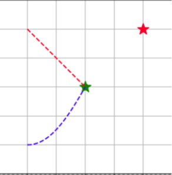
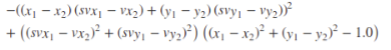
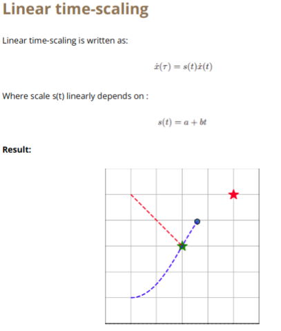
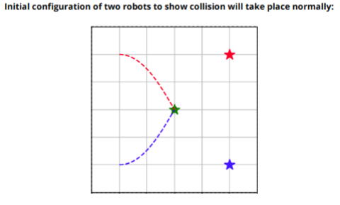

# Time-scaling based collision avoidance maneuvers for non-holonomic robots. 

<b>Components:</b>
1. Rule based Time Scaling
2. Colission Cone based Time Scaling
3. Linear Time Scaling
4. Multi-agent case Time Scaling

### Constant time-scaling
Given a holonomic dynamic obstacle with precisely known trajectory, you are required to time-scale the trajectory of a non-holonomic robot so that collisions are avoided. 

Assume a fixed trajectory for the dynamic obstacle with constant velocity (say, a straight line trajectory, or a polynomial Bernstein trajectory between fixed start and goal positions). Make sure there are indeed collisions between the robot and the obstacle without time-scaling.

Time-scaling by a constant may be written in the following form: $\dot x(\tau) = k\dot x(t)$

###### For choosing the scaling constant, we test two approaches:
1. <b>Rule-based constant:</b> Fix a sensor radius of the robot, within which collisions with an obstacle may be detected. Scale the trajectory of the robot to avoid collisions with the obstacle once it reaches within the sensor limit by a pre-defined constant.

<b>Chosen k value:</b> 2.5218996686355557 (Chosen based the velocity limits)

###### Initial Setup to show collision takes place normally:

        

        

<b>Blue Color:</b> Robot 
<b>Red Star:</b> Goal Location for Robot

##### FAQ
<b>Question:</b> What problems do you notice with this simple approach?
<b>Answer</b>: In this case we only have a hard constraint on the scaling value being used which is dependent on the velocity limits etc. So this leads to a jerkier motion though it is able to avoid the obstacle. But rather in the collision cone approach we get a range of values based on the more robust velocity obstacle approach i.e. collision cones.

*** 

2. <b>Collision-cone based:</b> Find a range of values for the appropriate scaling constant k based on the Velocity Obstacle approach discussed in class. As a hint, the constant should be the solution of a system of inequalities coming from the velocity limits and the collision cone. You may find the following useful: https://docs.scipy.org/doc/scipy/reference/generated/scipy.optimize.linprog.html. Choose any of the suitable constants and scale the robot trajectory to avoid collisions 

<b>Polynomial to get range of s:</b>

        

### FAQ
<b>Question 1: </b>How can we ensure smoother robot trajectory using time-scaling to avoid discontinuities?

<b>Answer</b>:
In the generation of trajectory as we define the velocity limits etc, we also are able to get a trajectory optimisation where we minimize the cost function that encompasses two parts: 1) Cost function to reach the goal 2) Cost function to ensure smoothness. This second cost function is dependent on velocities to generate a smoother trajectory without a lot of jerks and can be defined as follows: 
This way despite having to scale the trajectory for time scaling to be able to avoid obstacles, we are able to minimize it by optimizing on this cost function.

<b>Question 2:</b> You have been taught Model Predictive Control for robot trajectory planning in class. Suppose you start with an initial guess for the robot trajectory. How would the trajectories given by MPC vary from that given by simple time-scaling with respect to the initial guess, given both are able to avoid collisions successfully?

<b>Answer</b>: 
In MPC, we track the error continuously and model the trajectory and bring changes to it based on the waypoints being generated around the obstacle and then return back to its trajectory.

But in the case of time scaling, we see that the trajectory path formed initially doesn't change but rather the avoidance is done based only on the scaling of the trajectory.

<b>Question 3:</b> How would you extend time-scaling to a system of two robots trying to avoid collisions with each other?

<b>Answer</b>: 
The rule base constant method has been employed here wherein the checking for collision is just one robot treating the other robot as a dynamic obstacle and vice versa by seeing if the center of object is 5m away from the robot. 
For every robot and given its kinodynamic model and the current position and velocity of all neighboring robots, we can compute a collision-free trajectory for the robot under the assumption that all other agents follow the same algorithm for collision avoidance or their velocity remains constant during the planning horizon.
This way as both the robots implement the collision free trajectory planning, we only have to timescale one robot faster than the other robot by choosing appropriate k value.
In our code example, k is taken such that the 1st robot is 16 times faster than the second robot by the virtue of time scaling.

         

        <b>Result</b> 

        

___